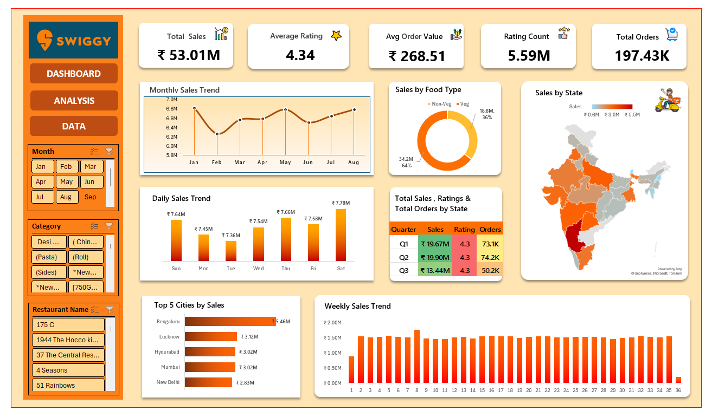

# 🍊 Swiggy Sales & Analytics Dashboard — Microsoft Excel

> **An end-to-end Excel dashboard for exploring sales, orders, ratings, food categories, and geographic performance through interactive data visualization.**

---

## 📊 Project Overview

This project presents an **interactive Swiggy Sales & Analytics Dashboard developed entirely using Microsoft Excel**.

The objective of the dashboard is to transform structured Swiggy-related data into a clear and interactive analytical view that can help users understand overall sales performance, order activity, customer ratings, food-type distribution, and geographic performance.

Rather than presenting individual tables or isolated charts, the project brings important business metrics together into a single dashboard experience. This makes it easier to monitor performance, compare different dimensions, identify trends, and explore the data using interactive filters.

The dashboard was developed as an **end-to-end Excel project**, covering data analysis, KPI development, visualization, dashboard layout, and interactive filtering.

The project was also developed with reference to an Excel dashboard tutorial that demonstrated the overall dashboard-building approach and Swiggy-themed analytical concepts. The concepts were then implemented as part of this Excel project.

---

## 🎯 Project Objectives

The primary objective of this project is to demonstrate how Microsoft Excel can be used to develop a practical, interactive, and business-oriented analytics dashboard.

The project focuses on:

* Understanding overall sales performance
* Monitoring total order volume
* Evaluating average customer ratings
* Understanding Average Order Value
* Analyzing sales trends over different time periods
* Comparing sales across food categories
* Exploring state-wise performance
* Identifying top-performing cities
* Comparing sales, ratings, and orders across quarters
* Providing interactive filtering for deeper analysis
* Presenting multiple business metrics through a single visual interface

---

## 🖼️ Dashboard Preview



---

## 📌 Dashboard at a Glance

The dashboard brings together several important performance indicators and analytical views.

### Key Performance Indicators

| KPI                     |   Value |
| ----------------------- | ------: |
| **Total Sales**         | ₹53.01M |
| **Average Rating**      |    4.34 |
| **Average Order Value** | ₹268.51 |
| **Rating Count**        |   5.59M |
| **Total Orders**        | 197.43K |

These KPIs provide a quick snapshot of the overall performance represented in the dataset.

---

# 🔎 Dashboard Analysis

## 1. 💰 Sales Performance

The dashboard provides a consolidated view of sales performance through multiple time-based and categorical visualizations.

The analysis includes:

* Overall Total Sales
* Monthly Sales Trend
* Daily Sales Trend
* Weekly Sales Trend
* Sales by Food Type
* State-wise Sales Performance
* Top 5 Cities by Sales

These views help in understanding how sales are distributed and how performance changes across different periods and locations.

---

## 2. 📅 Time-Based Analysis

Time-based analysis is an important component of the dashboard.

The dashboard allows sales performance to be examined through:

### Monthly Sales Trend

The monthly trend provides a broader view of sales movement throughout the year and helps identify periods of comparatively higher or lower sales activity.

### Daily Sales Trend

The daily analysis provides a more granular view of sales behavior and allows users to observe how sales vary across individual days.

### Weekly Sales Trend

The weekly view helps identify recurring patterns and variations in sales activity over different weeks.

Together, these visualizations provide multiple levels of time-based analysis instead of relying on a single trend chart.

---

## 3. 🍔 Food Type Analysis

The dashboard includes a comparison of sales across different food types.

This allows users to explore:

* Which food categories contribute more to sales
* How sales are distributed across food types
* Differences between categories
* Relative contribution of different food segments

The category-level analysis provides another perspective for understanding overall sales composition.

---

## 4. 🗺️ Geographic Analysis

Geographic performance is another important part of the dashboard.

The dashboard includes a **state-wise sales visualization**, allowing users to compare sales performance across different regions.

It also highlights the **Top 5 Cities by Sales**, making it possible to identify locations that contribute significantly to the overall sales value.

This combination of state-level and city-level analysis provides both a broader geographic view and a more focused view of high-performing locations.

---

## 5. ⭐ Ratings & Customer Activity

Customer ratings are incorporated into the dashboard to provide an additional perspective beyond sales.

The dashboard includes:

* Average Rating
* Rating Count
* Quarterly rating comparison
* Relationship between ratings and order activity

The **4.34 average rating** provides a high-level indicator of customer feedback represented in the dataset.

The rating count also provides context regarding the scale of customer feedback available for analysis.

---

## 6. 🛒 Order Analysis

Orders are represented through both KPI-level and trend-based analysis.

The dashboard tracks:

* Total Orders
* Orders across quarters
* Order trends over time
* Relationship between order activity and sales

The dashboard reports **197.43K total orders**, providing a quick indication of the order volume represented within the analyzed data.

---

## 7. 📊 Quarterly Performance

The dashboard also provides a quarterly comparison of:

* Sales
* Ratings
* Orders

Quarterly analysis makes it easier to compare performance across broader time periods and identify differences between quarters.

Instead of looking only at sales, the dashboard brings multiple performance indicators together for a more comprehensive comparison.

---

# 🎛️ Interactive Dashboard Features

One of the key strengths of the dashboard is its interactive filtering capability.

Users can explore the dashboard based on selected dimensions such as:

* **Month**
* **Category**
* **Restaurant**

These filters allow users to move from an overall business view to a more specific analysis.

For example, a user can select a particular month or category and observe how the dashboard's visualizations respond to the selected criteria.

This makes the dashboard more useful for exploratory analysis compared with a static report.

---

# 🧩 Excel Techniques Used

The project demonstrates several practical Excel techniques used in data analytics and dashboard development.

### Data Analysis

The data was organized and analyzed to support meaningful comparisons across:

* Time
* Location
* Food category
* Orders
* Ratings
* Sales

### Pivot Tables

Pivot-based analysis was used to summarize and organize data into meaningful analytical dimensions.

### Charts & Visualizations

Different visual representations were used according to the type of information being analyzed.

These include:

* Trend charts
* Bar charts
* Donut/pie-style visualizations
* KPI cards
* Geographic visualization
* Comparative charts

### Slicers

Interactive slicers were incorporated to allow users to filter and explore the dashboard dynamically.

### KPI Design

Important business metrics were presented prominently at the top of the dashboard so that users can understand overall performance quickly.

### Dashboard Layout

The dashboard was organized into logical sections so that high-level KPIs, trends, comparisons, and detailed analysis can be viewed within a single interface.

---

# 📈 Key Metrics

The dashboard highlights five primary performance indicators:

### Total Sales — ₹53.01M

Represents the overall sales value available within the analyzed data.

### Average Rating — 4.34

Provides an overall view of customer ratings represented in the dataset.

### Average Order Value — ₹268.51

Indicates the average value associated with an order.

### Rating Count — 5.59M

Represents the volume of ratings available within the analyzed data.

### Total Orders — 197.43K

Represents the total number of orders included in the analysis.

Together, these KPIs provide a concise overview of sales, customer feedback, order activity, and transaction value.

---

# 💡 Business Questions Addressed

The dashboard is designed to help answer questions such as:

* What is the overall sales performance?
* How many orders are represented in the dataset?
* What is the average order value?
* What is the overall average customer rating?
* How do sales change over time?
* Which food types contribute more to sales?
* Which states show stronger sales performance?
* Which cities are among the top performers?
* How do sales and orders vary across quarters?
* How does customer rating activity vary over time?
* How can the data be explored using interactive filters?

These questions demonstrate how an Excel dashboard can move beyond basic reporting and support exploratory business analysis.

---

# 🔍 Analytical Perspective

One of the main goals of the project was to make the dashboard useful from a **business decision-making perspective**.

Instead of displaying every available field, the dashboard focuses on metrics and dimensions that can help users understand:

**Performance → Trends → Categories → Geography → Customer Activity → Orders**

This structure provides a logical flow from high-level performance indicators to more detailed analytical views.

The combination of KPIs, trend analysis, geographic analysis, category comparisons, and interactive filters creates a dashboard that can be explored from multiple perspectives.

---

# 🎨 Dashboard Design Approach

The dashboard uses a Swiggy-inspired visual theme to create a consistent presentation across different analytical elements.

The design focuses on:

* Clear KPI visibility
* Consistent visual hierarchy
* Easy-to-read charts
* Logical placement of analytical sections
* Interactive filtering
* Minimal unnecessary visual clutter
* Consistent use of typography and dashboard elements

The intention was to make the dashboard both **visually engaging and analytically useful**.

---

# 🛠️ Tools & Skills

### Primary Tool

**Microsoft Excel**

### Skills Demonstrated

* Data Analysis
* Data Cleaning
* Data Preparation
* Pivot Tables
* Pivot Charts
* Slicers
* KPI Development
* Data Visualization
* Dashboard Design
* Trend Analysis
* Category Analysis
* Geographic Analysis
* Business-Oriented Reporting
* Interactive Data Exploration

---

# 📂 Project Structure

```text
swiggy-excel-dashboard/
│
├── README.md
│
├── dashboard/
│   └── Swiggy_Sales_Analytics_Dashboard.xlsx
│
└── screenshots/
    └── Swiggy_Dashboard.png
```

---

# 📁 Repository Contents

## `dashboard/`

Contains the main Excel workbook used for the project.

**File:**

`Swiggy_Sales_Analytics_Dashboard.xlsx`

The workbook contains the Excel-based dashboard and associated project work.

---

## `screenshots/`

Contains the dashboard preview image used to showcase the final dashboard.

**File:**

`Swiggy_Dashboard.png`

---

# 🎓 Learning Outcomes

This project provided practical experience in building an analytics dashboard from the ground up using Microsoft Excel.

Through this project, I strengthened my understanding of:

### Data Preparation

Understanding how structured data needs to be organized before meaningful analysis can be performed.

### Data Analysis

Exploring sales, orders, ratings, categories, locations, and time-based patterns.

### Dashboard Development

Combining multiple analytical components into one structured dashboard.

### Data Visualization

Selecting appropriate visualizations to communicate different types of information.

### Interactive Reporting

Using slicers and filters to allow users to explore different segments of the data.

### Business Thinking

Moving from simply calculating numbers to presenting information in a way that can support business-oriented analysis.

---

# 🚀 Project Highlights

### ✔ End-to-End Excel Dashboard

The project covers the complete dashboard development process, from data analysis to final presentation.

### ✔ Interactive Analysis

Users can filter the dashboard and explore different segments of the data.

### ✔ Multiple Analytical Dimensions

The dashboard combines:

**Sales + Orders + Ratings + Categories + Time + Geography**

### ✔ KPI-Driven Reporting

Key metrics are placed prominently for quick performance assessment.

### ✔ Visual Storytelling

The dashboard combines different charts and visual elements to communicate information more effectively.

### ✔ Business-Oriented Design

The dashboard is structured around practical questions related to sales and customer activity.

---

# 📚 Learning Reference

This project was developed with reference to the following tutorial:

### Build an Excel Dashboard from Scratch | End-to-End Project | Excel Tutorial 2026

🔗 **YouTube:**
https://youtu.be/OrkjQdZLXyk

The tutorial was used as a **learning and implementation reference** for understanding the dashboard-building approach and analytical structure.

The final project was implemented in **Microsoft Excel** and documented here as part of my hands-on data analytics portfolio.

---

# 🔮 Possible Future Improvements

The project can be further extended with additional analytical capabilities, such as:

* Additional KPI cards
* More detailed customer segmentation
* Year-over-year performance comparison
* Profitability analysis if cost and margin data are available
* More granular city-level analysis
* Automated data refresh
* Additional time-period comparisons
* Advanced Excel formulas and analytical models
* Expanded dashboard filtering options
* Automated reporting and presentation

These improvements could help evolve the dashboard from a static analytical workbook into a more comprehensive business intelligence solution.

---

# 🎯 Why This Project Matters

This project demonstrates how Excel can be used not only for spreadsheet-based calculations, but also as a practical **data analytics and business reporting tool**.

By combining structured data, KPIs, Pivot Tables, visualizations, slicers, and dashboard design, the project demonstrates the process of turning raw information into an interactive analytical experience.

The project is particularly relevant to areas such as:

* Data Analytics
* Business Intelligence
* Sales Analytics
* Business Reporting
* Data Visualization
* Dashboard Development

---

# ⭐ Final Note

⭐ **Thank you for exploring this project!**

Your feedback and suggestions are always welcome. Feel free to explore the repository and connect with me for more data analytics projects and dashboards.

